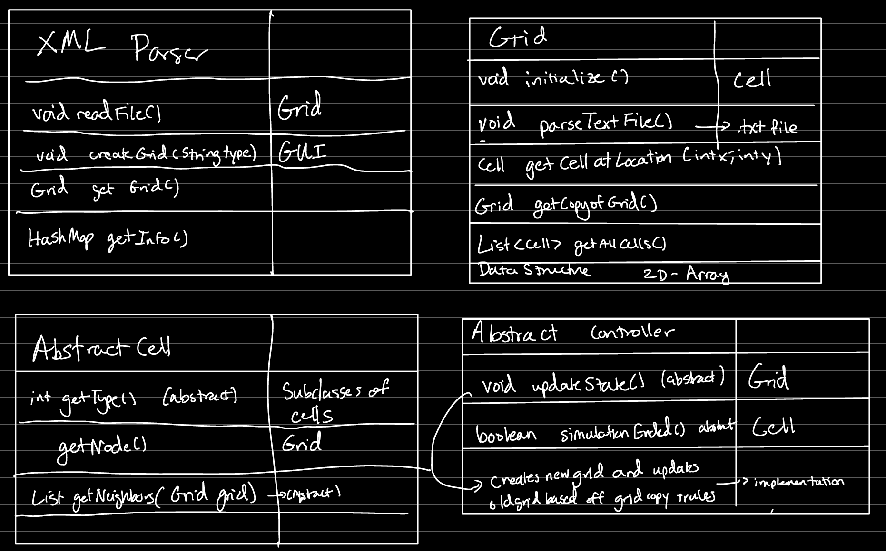
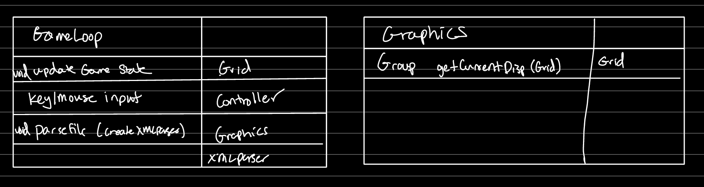
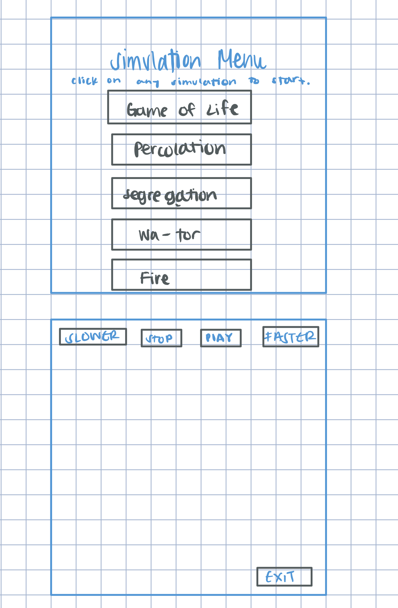
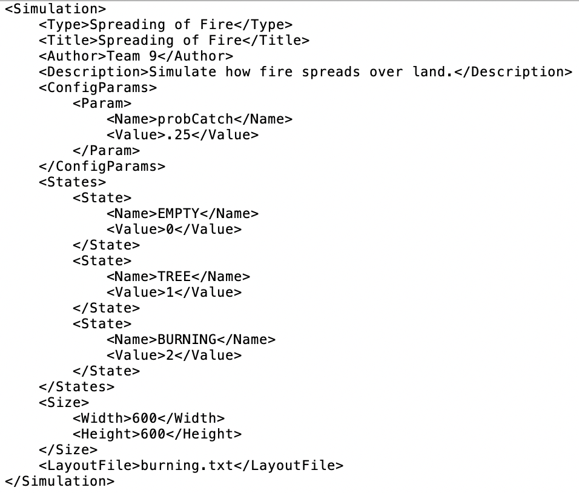
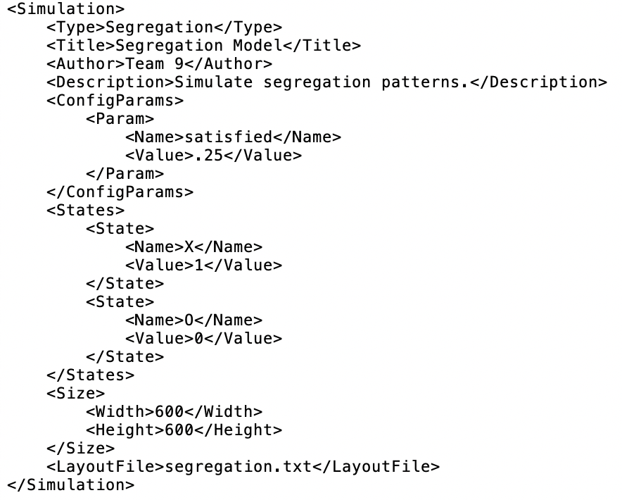
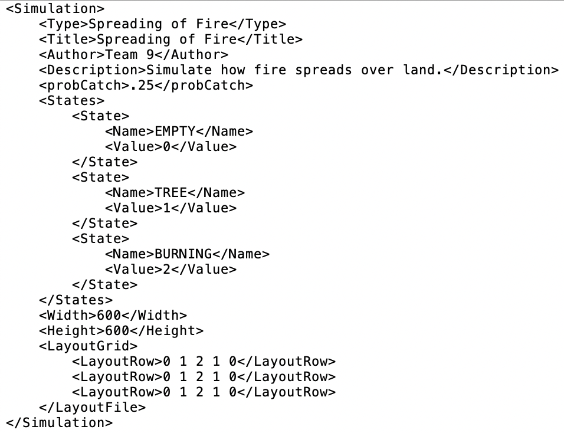
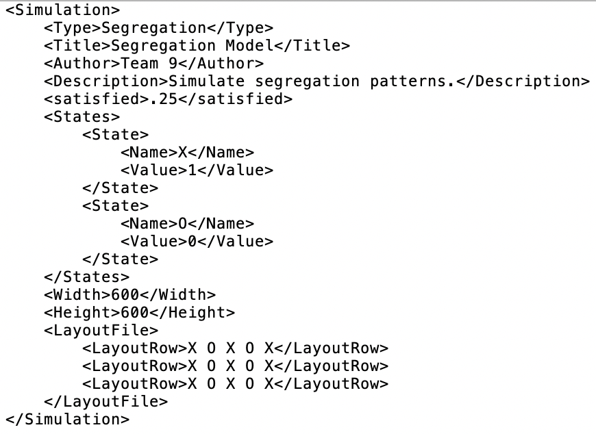

# Cell Society Design Plan
### Team Number 09
### Names
Livia Seibert (las120)
Billy Luqiu (wyl6)
Lola Maglione (cm524)

## Overview

We will use the model view controller interface. We want a grid of cells whose rules come from the model that is being updated by a controller and is being displayed on a user interface at regular intervals.

We intend to create abstract classes for the cell and controller and create separate classes for each game we are required to implement. We will have a XML parser class that will create the grid object, and the grid object will initialize all cells for that grid. A controller will update the grid and implementation details are provided in the CRC cards. As far as the display goes, we will have a main game loop class that will update the game state and graphics (which is a separate class) periodically. Additionally, the game loop will handle key/mouse input.

We decided to implement the grid using a 2D array. This will represent a 2D grid of cells that will either be filled or the cells will be null values if there is no cell there.

Additionally, we decided to implement the XML file as described below. 
<insert image here> 

## User Interface

The initial screen will start with a “simulation menu” where the user will have the option to choose what simulation they want to do. There will be buttons for the user to click to start each type of simulation. When you start a simulation there will be a menu at the top with slower, faster, play and stop buttons.  At the bottom of the screen there will be an exit button that takes you to the starting screen with the simulation menu. This way you can switch simulations in the middle of running another simulation.

## Configuration File Format

This is one potential design for the XML file, shown working on two different types of simulations. In this design, ConfigParams and States are able to have sub-tags to let more than one parameter and more than one state be specified in the configuration. LayoutFile is also used to store a reference to a .txt file that can then be parsed into the game separately.

This is another potential design for the XML file. This time, satisfied and probCatch are their own tags instead of being params in the ConfigParams tag. I don’t think that having them be their own tags is a better design, as these tags will be different for every XML file. With the first design, ConfigParams and Params can be used for every simulation. The other major difference is that the layout is specified in the XML file directly instead of having a reference to a .txt file. I don’t think that including the layout in the XML file versus in the .txt file will create any major differences in amount of code needed or difficulty of implementation, but it does condense the location of the data and prevent file not found errors from the .txt file.

## Design Details
We will go over every class in detail.

XML Parser - the XML parser will be called in the main game loop and will create the grid and allow for easy retrieval of the information of the current simulation, and it will call the grid to initialize the grid with the given text file of configuration. We created a separate XMLParser as we felt like this should not be handled in the GameLoop and instead ought to be its own class. This class will work for all games where we have a XML file formatted in the requisite manner, but if the XML file format we choose does not allow for the implementation of a specific feature, then the parser would have to change as well. This code assumes that the file is well formatted and does not contain any errors.

Grid - The Grid class will represent the grid of cells that we will implement. It will be general across all simulation types as all simulations rely on a grid of cells to some degree. The code currently assumes that the grid can be represented as a 2D Array which means that the locations of the cells will be discrete values. We chose this as the grid can always be made larger to approximate continuous cell locations as discrete ones with acceptable levels of precision. The grid class also parses the text file when initialized. We chose this as this would allow for direct implementation of the text in the grid class. The grid class also has methods to get a copy which will be needed for the controller, and a method to get all the cells which will be needed for the graphics class to display all the cells.

Abstract Cell - We chose to make an abstract cell class as each different simulation has cells with varying attributes. Thus, we have abstract methods of getNeighbors (which will define which cells depend on which other cells) and getType (which determines which type of cell it is for each different simulation. However, we decided to have a Node attribute that was the same throughout all the cells as the Node (how the image is displayed) is the same throughout all different simulations. The cell has the pointer of the grid it is located in in order to determine its neighbors. In order to make a new simulation type, we would simply have to extend a subclass of the cell class and provide implementation details surrounding the types of cells and how to get the neighbors of the cells there, as well as what image file is being used to represent the cell.

Abstract Controller - We chose to make the controller class abstract and to implement a different controller for each simulation as each simulation has its own set of rules. Thus, all methods in controller are abstract as updateState and simulationEnded will be different depending on the requirements of each simulation and how that simulation updates its state for instance. The controller depends on the grid and cell to update the contents of the cells. In order to support another type of simulation, we would have to create a separate subclass of the controller class and provide implementation details surrounding how that simulation updates its cells there as well as when that simulation has stopped.

GameLoop - The Gameloop class will be the main driver for the simulation. As such, it has methods to handle key/mouse inputs, and will call XMLParser as needed. It will also have the main updateGameState function which will call the controller and graphics class as needed. The gameloop assumes the game is being run continuously, and we will be able to handle slower/faster gameloop mechanisms.

Graphics - The graphics class has the sole responsibility of managing the graphics and updating it when called from the game loop. We decided to make it a separate class from the GameLoop in order to shield implementation details about the graphics from the game loop, and to prevent the game loop from getting too large.

## Design Considerations
We need to figure out specifics regarding implementation such as private helper methods within each method. Additionally, we need to figure out what instance variables each class should have as well. We discussed whether to find the neighbors of a particular cell in the cell or grid class at length. The pros of putting it in the grid class was that we wouldn’t have to keep track of the grid in the cell class, keeping it one way relationship. However, by putting the getNeighbors method in the cell class, we could have implementation details regarding which cells were considered neighbors different for each type of simulation. We considered this better design as we could better separate each simulation’s rules in the cell class. We decided to create separate classes for the cell and controller for each simulation as we decided it would be easier to code than changing the rules of the game on the fly through configuration files.

Additionally, we discussed the pros and cons of a 2D array vs a graph implemented using an adjacency list. The benefit of a 2D array for us was simplicity, as we wouldn’t need to keep track of the neighbors of each cell in the graph but instead could just keep track of the neighbors using a separate algorithm that would be called as needed. The benefit of a graph is that we can dynamically resize it during the runtime, but we figured that the simulation size would be fixed for a majority of the runs after runtime, and we could always allocate a new grid as needed. Thus, we decided to use a 2D array for now due to simplicity.

## Use Cases
* Apply the rules to a middle cell: set the next state of a cell to dead by counting its number of neighbors using the Game of Life rules for a cell in the middle (i.e., with all its neighbors)
    * The controller for the specific simulation we are running will be looping through all of the cells in a copy of the grid within its updateState method when it lands on a middle cell. This middle cell will call getNeighbors, which is a polymorphic method since each implementation of the abstract cell class will have its own getNeighbors function. Since the cell is a Game of Life cell, its getNeighbors function knows to count all 8 of its neighbors and return them back to updateState. updateState will also be a polymorphic method, so this specific Game of Life updateState function will tally up the number of living and dead neighbors and set the cell to dead on the actual grid (not the grid copy).
* Apply the rules to an edge cell: set the next state of a cell to live by counting its number of neighbors using the Game of Life rules for a cell on the edge (i.e., with some of its neighbors missing)
    * Since the getNeighbors method in the Game of Life controller wants to find 8 neighbors for the cell, the method will need to have bounds checking for cells that are on the edge. If the desired neighbor coordinates are outside of the grid size, then the method won’t try to retrieve these cells from the grid. Only valid cells will be returned in the list to updateState.
* Move to the next generation: update all cells in a simulation from their current state to their next state and display the result graphically
    * The polymorphic updateState function will loop through all of the cells in the grid, get the list of neighbors of each cell from the getNeighbors method, and appropriately parse that list of neighbors according to the rules of the specific simulation we are running. Once the list of neighbors is parsed, the next state can be determined and set on the actual grid. Then, this updated grid will be sent to the Graphics class, which will change all of the graphics to their new graphic depending on the state and send it to the scene to be rendered.
* Set a simulation parameter: set the value of a global configuration parameter, probCatch, for a simulation, Fire, based on the value given in an XML fire
    * This parameter would be set in the <ConfigParams> tag in the XML file. It would get the <Name> tag set to probCatch, and the <Value> set to whatever the probability of a tree catching fire should be. Then, the XMLParser class will read in this XML file, and pass all the pertinent data to the controller so that the value can be used in game play.
* Switch simulations: load a new simulation from an XML file, stopping the current running simulation, Segregation, and starting the newly loaded simulation, Wa-Tor
    * The user interface will have an exit button that the user can click when they want to stop running the current simulation and switch to a new one. The exit button will take the user back to the main menu screen, where they can select a new simulation to run. Clicking the button for Wa-Tor will load the Wa-Tor XML file, generating the new simulation.
* Speed up or slow down the simulation: make Segregation  simulation run faster, then slower
    * To speed up the simulation, the user can click the faster arrow at the top of the page. This click will be registered in the key handler function in the main Gameloop class, and will trigger a private method within the class that calls step at much shorter intervals, thereby speeding up the game since step is called more often and updates the state more often. Then, the user will click the slow down arrow at the top of the page and the same key handler function will be called, triggering a private method that calls step at much longer intervals so that the state updates less often.
* Pause or play the Wa-Tor simulation
    * The main Gameloop class will have a boolean variable called play. The step function will only run if play is true, so when the user hits the pause button in the simulation a private stopSimulation function will be called in Gameloop that sets play to false. Then, step won’t run, so the state of the grid won’t update. When the user hits the play button again, play will be set back to true and step will resume updating the game.
* Alter the starting layout for the Fire simulation
    * The starting layout for the simulation is specified in the XML file under the tag <LayoutFile>. The value within <LayoutFile> is the name of a .txt file that is located in the data folder of the project. When readFile is called by the XMLParser class, it will read in that text file and render the layout based on its contents. To change the starting layout, simply change the filename in the LayoutFile tag for the simulation to refer to the new file you’ve created for the simulation.
* Change the image for the state of the Fire Burning simulation cells
    * The image for the state of the cell will be represented within the cell class for that particular simulation. Since each cell class is a different implementation of the abstract cell class, the specific Fire cell class will have a HashMap with the states for that particular simulation and the image that represents that state. The Graphics class will access the image for each state from that HashMap. So, to change the image for the state of the Fire cell, you would just have to alter the graphic specified in the HashMap in the Fire cell class.
* Non rectangular grid (you have a triangular field in the fire simulation)
    * We would have to have a separate character in the XML file representing an empty cell, and we would have to create a separate instance variable for the cell to represent a completely empty cell with no data contained in it. Thus, the cell would be created but would represent a completely empty cell.
* Change the title for the segregation simulation from Segregation to Schelling’s Model of Segregation
    * Change the Title tag of the XML file of the game to be Schelling’s Model of Segregation. When the XML file is reloaded, the XML parser will take the Title tag and its value and put them into a HashMap with the other attributes of the game. This HashMap will then be passed to the controller for the game so that the new attributes can be used in this simulation. Since the controller has access to the new title, the Graphics class will then be able to display it in the game.

## Team Responsibilities

* Team Member #1 Livia Seibert - Model (parser/grid/all cell classes)

* Team Member #2 Lola Maglione - visualization (design front end/game loop/graphics class)

* Team Member #3 Billy Luqiu - controller (write all controller subclasses) 

